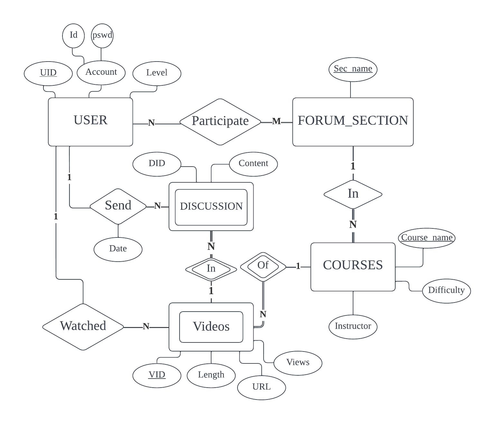
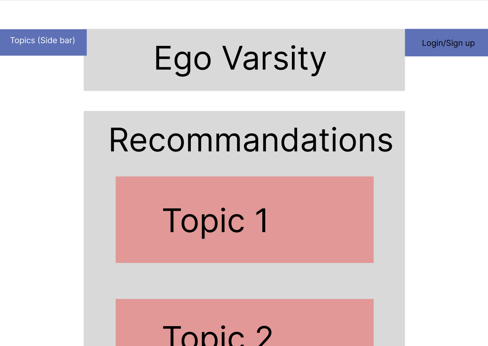
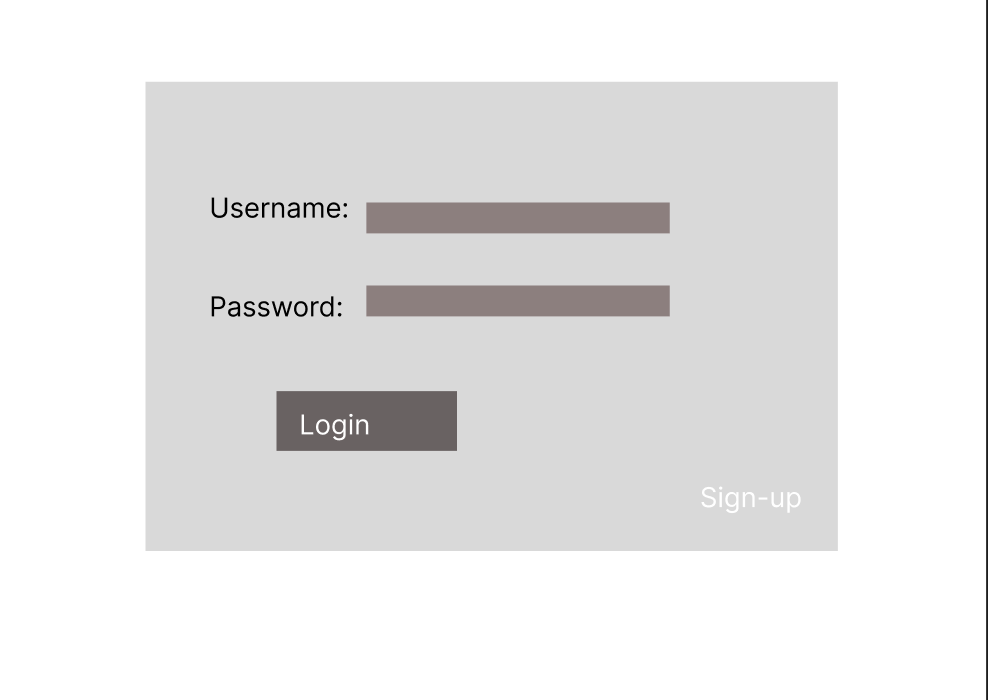
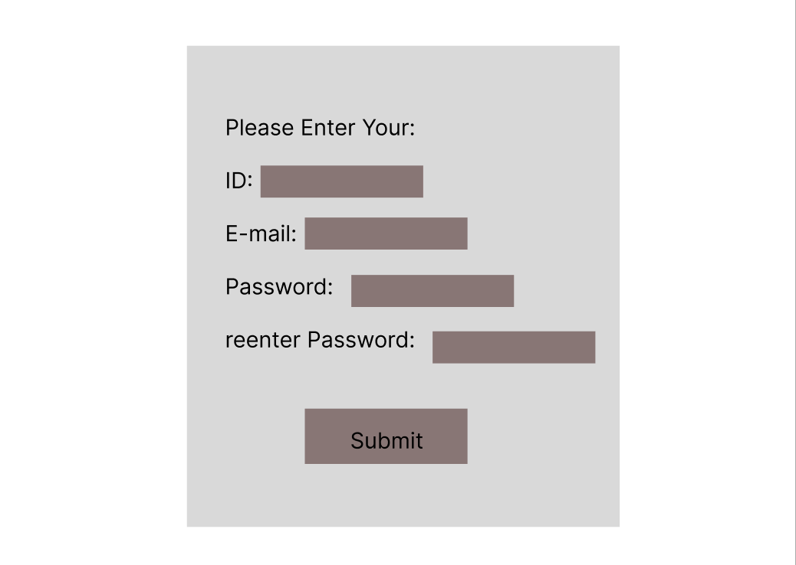
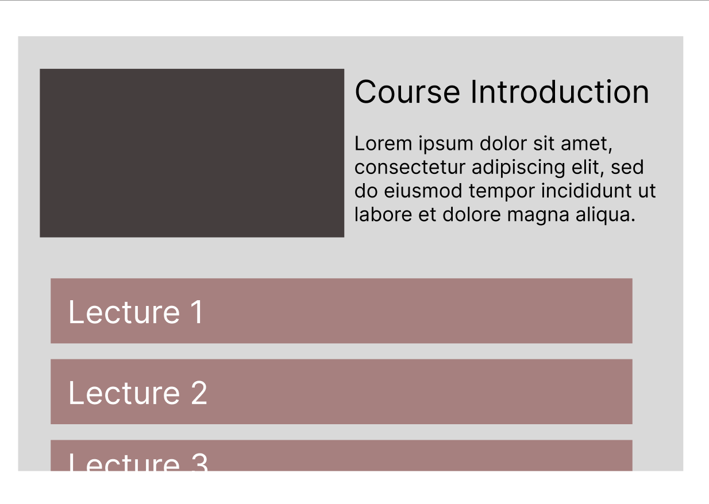
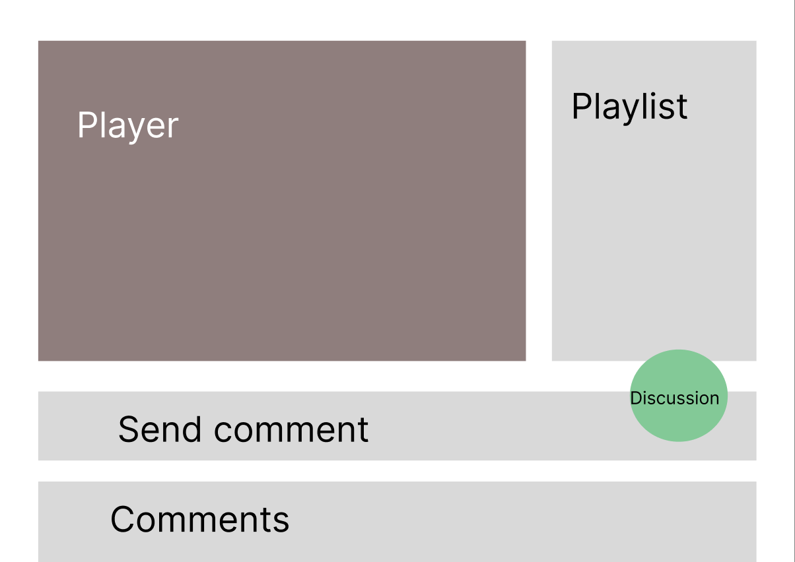
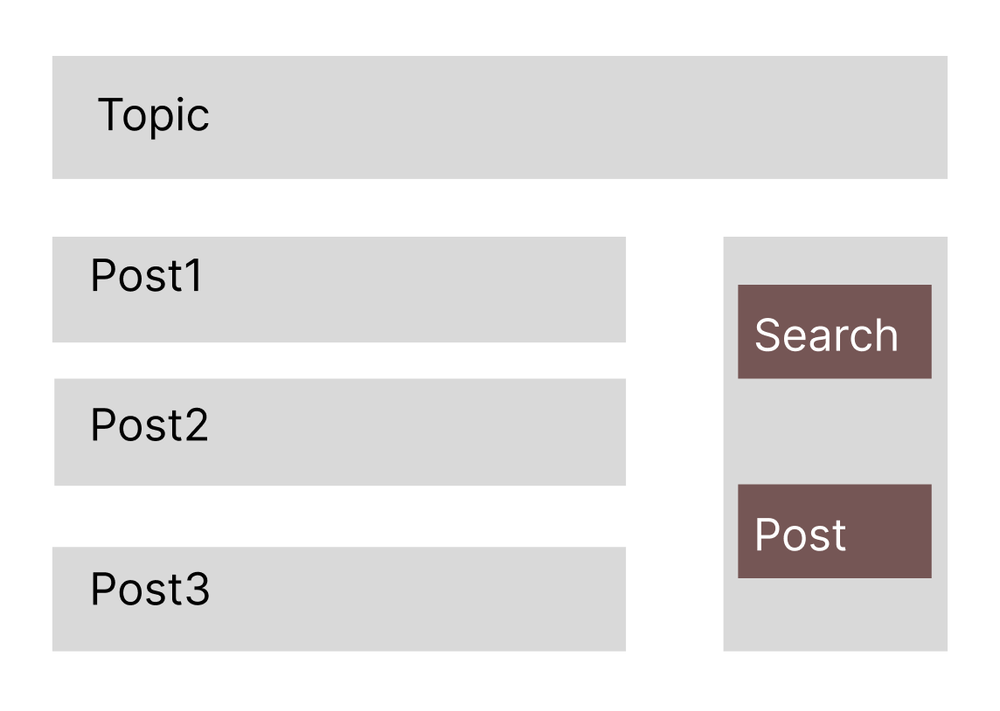
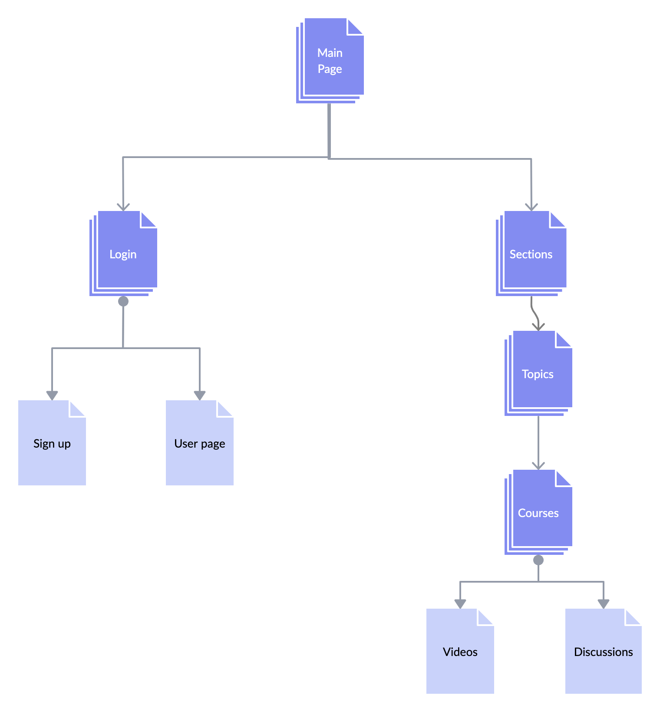

# Ego Varsity

## Overview

Computer Science is a one of the most selected major across the world and one of the most prominant field for career and academy research. 

The resource for one to learn any aspect of CS is without doubt more than abundant, but two problems come with the abundancy itslef: where to start and what to choose.

Ego Varsity is aiming to offer a clear learning path with solid material from well-known Universities around the world for people who are overwhelmed as a beginner.


## Data Model


The application will store **Users**, **Comments**, **Courses**, **Videos**, **Forum Sections**:


<figure>
<div style="text-align:center">

<figcaption><b>E-R Model of Ego Varsity</b></figcaption>
</div>
</figure>


An Example USER:

```javascript
{
  uid: "6120974",
  pswd: // a password hash,
  id: "Hoooao",
  level: 100
}
```

An Example VIDEO:

```javascript
{
  tile: "CS144: Computer Networking 01"
  length: 122241,
  url: ,// url to Youtube
  views: 12,
  comments: [
    //undecided comment objs with user,date,content and so on...
  ]

}
```

An Example DISCUSSION:

```javascript
{
  tile: "title of the post?"
  topic: "Computer Networking",
  views: 12,
  content: "Wat is TCP",
  course: //ref to a COURSE.Course_name,
  video: //ref to a VIDEO.Title
  comments: [
    //undecided comment objs with user,date,content and so on...
  ]

}
```

An Example COURSE:

```javascript
{
  course_name: "CS144: Computer Networking",
  introduction: "This is a course"
  difficulty: 1
  instructor: "Keith Winstein"
}
```

An Example TOPIC:

```javascript
{
  topic_name: "Computer Networking"
}
```


## Since I use SQL, there is currently no MongoDB schemas

<br>

## Wireframes


/main - main page



/login - page for logging in



/signup - page for signning up



/topic/somecourse - page for some course



/topic/somecourse/video - page for some video



/topic/forum - page for forum of some topic



## Site map

<figure>
<div style="text-align:center">

<figcaption><b>Site Map</b></figcaption>
</div>
</figure>

## User Stories or Use Cases

1. as non-registered user, I can register a new account with the site
2. as a user, I can use the recommandations or the side-bar to choose a topic I like, like Computer Networking
3. as a user I can watch public courses for a topic, like CS144 at Stanford in the Computer Networking topic
4. as a user I read others' posts, notes in the topic's forum section
5. as a user I can post questions, notes in a forum for a specific topic
6. as a user I can commant on a specific video for a course
7. as a user I can petite for new videos to be uploaded

## Research Topics

(__TODO__: the research topics that you're planning on working on along with their point values... and the total points of research topics listed)

* (5 points) React
    * I'm going to implement this site as an SPA
    * Learn routing in React
    * It's a challenging library to learn, so I've assigned it 5 points
* (4 points) Material UI
    * I will use customized Material UI for the UI design
* (5 points) Relational database system
    * I will use relational database instead of MongoDB as my DBMS
    * I will use Enahnced Entity Relational Diagram and Relational Model as guidance for the DB design
    * 

14 points total out of 8 required points


## [Link to Initial Main Project File](server/server.mjs) 


## Annotations / References Used

(__TODO__: list any tutorials/references/etc. that you've based your code off of)

1. [Material UI](https://mui.com/zh/) 
2. [React](https://reactjs.org/docs/getting-started.html) 

